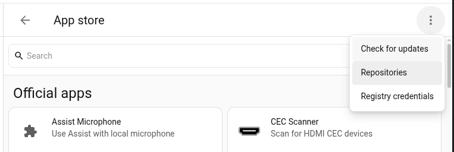
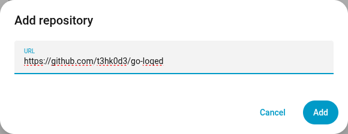

# go-loqed

- **loqed-mqtt** (`loqed-mqtt/`): a local-first MQTT gateway for LOQED
  locks with Home Assistant discovery and automatic cloud fallback. To
  install it, see [Installation](#installation).
- **GoLoqed** (`bridge`, `cloud`, `cloud/portal`): a Go client for the LOQED
  local Bridge API, the cloud Lock API and the Integrations portal. See
  [Go library](#go-library).

## Go library

[](https://pkg.go.dev/github.com/t3hk0d3/go-loqed)

    go get github.com/t3hk0d3/go-loqed

The library needs Go 1.22 or newer and uses only the standard library; the
gateway is a separate module, so none of its dependencies come along.

```go
ctx := context.Background()

// A personal access token from https://integrations.loqed.com/personal-access-tokens
// (or create one with cloud/portal from your email and password).
locks, err := cloud.New(token).ListLocks(ctx) // at most 12 per 12 h: keep the result
if err != nil { /* ... */ }
l := locks[0] // check l.HasLocalCredentials() first

b, err := bridge.New(l.BridgeIP, bridge.Credentials{
	BridgeKey: l.BridgeKey, KeySecret: l.KeySecret, LocalKeyID: uint8(*l.LocalID),
})
if err != nil { /* ... */ }
_ = b.CreateWebhook(ctx, "http://192.168.1.10:8099/loqed", bridge.AllTriggers)

switch err := b.Command(ctx, bridge.ActionLock); {
case err == nil: // received by the bridge; the webhooks confirm the move
case errors.Is(err, loqed.ErrUnreachable): // never left: safe to send again
case errors.Is(err, loqed.ErrNoResponse): // may have arrived: never resend
}

// In the handler for http://192.168.1.10:8099/loqed:
ev, err := bridge.ParseEvent(b.BridgeKey(), body,
	r.Header.Get("HASH"), r.Header.Get("TIMESTAMP"), time.Now())
```

Rules a caller must follow (the package documentation has the details and
runnable examples):

- A bridge answers every command with HTTP 200, even one the lock rejects.
  Only its webhooks (`GO_TO_STATE_*` with your key id, then
  `STATE_CHANGED_*`) confirm a command; `/status` lags.
- Send a command again only after `loqed.ErrUnreachable`, never after
  `loqed.ErrNoResponse`: the lock may already be moving, and a second
  `OPEN` unlatches the door again.
- An `http.Client` you pass in must disable keep-alives and must not follow
  redirects.
- LOQED blocks an account for 12 hours after more than 12 cloud status reads
  (`ListLocks`) in 12 hours.
- Bridges are addressed by IP address; hostnames are rejected. Cloud
  webhooks are unsigned, so protect their URL with a secret.

## Why loqed-mqtt instead of the built-in integration

- **More reliable.** Careful retries, and automatic cloud fallback when the
  local network gets in the way (separate VLANs, firewall rules, a bridge that
  changed its IP), without going over LOQED's limit of 12 status reads per 12
  hours. You don't need retry or fallback logic in your automations.
- **Safer commands.** A command counts as done only when the lock confirms
  it, and `OPEN` is never sent twice. Your automations can act on a confirmed
  result or a `command_failed` event instead of hoping the door locked.
- **More informative.** Who or which key last used the lock, every lock
  event, Wi-Fi and battery details, connection mode, and a flag when the
  state may be out of date.
- **No webhook address to configure.** For each bridge, the gateway works
  out which of its own addresses that bridge can reach, registers its
  webhook there, and moves the registration when that address changes. It
  keeps working across VLANs, multiple network interfaces and DHCP
  renewals.
- **Low maintenance.** A new bridge IP or new keys are picked up
  automatically, the access token renews itself (with email and password
  set), and one instance covers every lock on the account.
- **Local and open.** Bridge events stay on your network even with Home
  Assistant Cloud. Any MQTT client can use the locks, and the gateway keeps
  tracking them while Home Assistant restarts.

The core integration needs no MQTT broker. Use one or the other per lock:
every extra webhook on the bridge delays events.

## Installation

You need:
- a LOQED lock with a LOQED Bridge;
- an MQTT broker;
- a LOQED **personal access token**, created at
  https://integrations.loqed.com/personal-access-tokens. Instead of a token,
  you can give your LOQED email and password, and the gateway creates and
  renews the token itself.

### Home Assistant OS (add-on)

1. Install the **Mosquitto broker** add-on, if you don't use another broker
   yet, and the **MQTT** integration.
2. Add this repository to the add-on store. Use this button:

   [](https://my.home-assistant.io/redirect/supervisor_add_addon_repository/?repository_url=https%3A%2F%2Fgithub.com%2Ft3hk0d3%2Fgo-loqed)

   Or add it by hand. Open *Settings → Add-ons → Add-on store* (called *Apps →
   App store* in recent releases), then choose *Repositories* in the ⋮ menu:

   

   Paste `https://github.com/t3hk0d3/go-loqed` and choose **Add**:

   

3. Install **LOQED MQTT Gateway**. It runs on amd64 and aarch64.
4. On the add-on's *Configuration* tab, set **Personal access token**, or your
   LOQED email and password.
5. Start the add-on. Each lock appears in Home Assistant as a device, through
   MQTT discovery. The add-on's *Documentation* tab covers every option.

### Docker

The image `ghcr.io/t3hk0d3/loqed-mqtt` runs on amd64, arm64 and arm/v7.
Start from `docker-compose.yml`:

```yaml
services:
  loqed-mqtt:
    image: ghcr.io/t3hk0d3/loqed-mqtt:latest
    restart: unless-stopped
    network_mode: host
    volumes:
      - loqed-data:/data
    environment:
      LOQED_CLOUD_TOKEN: "paste-your-personal-access-token"
      # or: LOQED_CLOUD_EMAIL / LOQED_CLOUD_PASSWORD
      LOQED_MQTT__URL: "tcp://192.168.1.10:1883"
      LOQED_MQTT__USERNAME: "loqed"
      LOQED_MQTT__PASSWORD: "change-me"
volumes:
  loqed-data:
```

Then run `docker compose up -d`. The gateway logs each lock it found.

- **Networking.** Use host networking. The bridge sends its webhooks to the
  gateway on port 8099, and the gateway picks the address for each lock
  itself: it asks the OS which local address the route to that lock's bridge
  uses (a UDP connect, which sends no packets). It checks this again on every
  registration check, and if the address changes, it replaces its own entry
  on the bridge. Without host networking, the address it finds is the
  container's, which the bridge cannot reach, and the log warns about it. In
  that case (or behind NAT or a port forward), publish port 8099 and set
  `LOQED_WEBHOOK__PRIVATE_URL` to `http://<docker-host-ip>:8099`.
- **Health check.** The image's `HEALTHCHECK` reads only the environment and
  `/data/options.json`. If you change the listen address, set it with
  `LOQED_WEBHOOK__LISTEN`.

### After installing

If the bridge is on another network (an IoT VLAN, for example), allow
connections from the bridge to the gateway on port 8099. Without that rule
the gateway still works, but it reads the bridge's status every minute
instead of receiving events, and its log warns about it.

If the log warns that it "rejected a bridge webhook with a stale timestamp",
the bridge delivered the webhook more than 20 s after signing it. This
happens when the bridge has many registered webhooks, because it calls them
one after another, or when the clocks differ. Remove old webhooks from the
bridge, check NTP, or raise `webhook.bridge_timestamp_tolerance` (for
example `60s`; `0` turns the check off, and a recorded webhook could then be
replayed on your network).

### Configuration

Settings come from three places, each overriding the one before:
1. `/data/options.json` (the add-on options);
2. an optional YAML file (`--config`);
3. `LOQED_*` environment variables. Nested keys use `__`, for example
   `LOQED_MQTT__BASE_TOPIC`.

The design spec, `docs/superpowers/specs/2026-10-04-loqed-mqtt-gateway-design.md`,
lists every setting.

## MQTT topics

| Topic | Retained | Payload |
|---|---|---|
| `loqed/status` | yes | `online` / `offline` |
| `loqed/<id>/availability` | yes | `online` / `offline` |
| `loqed/<id>/state` | yes | JSON state document |
| `loqed/<id>/event` | no | JSON lock event (incl. `command_failed`) |
| `loqed/<id>/command` | must not be retained | `LOCK`, `UNLOCK` or `OPEN`, or JSON `{"command":"LOCK","id":"my-id"}` |
| `loqed/<id>/command_status` | yes | JSON status of the last command |
| `loqed/<id>/cloud_webhook` | must not be retained | a LOQED cloud webhook body, forwarded unchanged (only with `mqtt.cloud_webhooks: true`) |
| `loqed/<id>/webhooks` | yes | JSON list of the bridge's webhooks (`revision`, `fetched_at`, `count`, `webhooks`) |
| `loqed/<id>/webhooks/set` | must not be retained | JSON request that replaces the bridge's webhook list (only with `mqtt.bridge_webhook_control: true`) |
| `loqed/<id>/webhooks/result` | no | JSON result of a `webhooks/set` request |

Retained messages on the `command`, `cloud_webhook` and `webhooks/set`
topics are ignored.

`cloud_webhook` lets a relay, typically a Home Assistant automation with a
Home Assistant Cloud (Nabu Casa) webhook trigger, deliver LOQED cloud
webhooks without a reverse proxy. The add-on documentation
(`addon/DOCS.md`, "Cloud webhooks") has the automation. The topic's `<id>`
selects the lock, exactly like the per-lock `/cloud/<secret>/<id>` URL; a
body for another lock is dropped with a warning.

`webhooks` shows every address the bridge calls for this lock. Each one
delays the others, so old entries explain late events. With
`mqtt.bridge_webhook_control: true`, a request on `webhooks/set` names the
complete list you want, with the `revision` of the list you edited:

```json
{"revision":"9f2c41d0a1b2c3d4","webhooks":[{"id":3},{"url":"http://192.168.2.11:8123/api/webhook/def"}]}
```

Listed webhooks are kept (or added), the rest are removed, and the
gateway's own webhook is always kept. The add-on documentation
(`addon/DOCS.md`, "Bridge webhooks") has the details.

`command_status` follows each command:

```json
{"command":"LOCK","id":"my-id","status":"confirmed","via":"local","attempts":1,"error":null,
 "received_at":"2026-10-06T12:00:00.000Z","updated_at":"2026-10-06T12:00:09.412Z"}
```

- `status` goes `pending` → `sending` → `sent` → `accepted` → `confirmed`, or
  ends `failed`, `expired` or `superseded`.
- `sent` only means the bridge or cloud received the request. The bridge
  answers every request, even one the lock will reject. A command counts as
  `accepted` when the lock starts moving with the gateway's key, and as
  `confirmed` when it reaches the target.
- `error` is set for `failed`: `unreachable`, `no_response`, `rejected`,
  `unauthorized`, `key_deleted`, `rate_limited`, `stalled`, `no_confirmation`
  or `offline`.
- The optional `id` (up to 64 printable characters) is echoed back, so an
  automation can match a status to its command.
- Only the latest command counts. A newer command replaces one that has not
  been sent yet, and that one ends as `superseded`. A command the bridge may
  already have received is never sent again.

## Releasing

Run the release workflow with the new version:

    gh workflow run release -f version=0.1.2

You can also use *Actions → release → Run workflow*. The workflow:

1. runs the tests on `master`;
2. commits the release (`release: 0.1.2`): the add-on version bump, and
   `CHANGELOG.md`'s `[Unreleased]` section moved under `[0.1.2]`, and the
   released versions written to `addon/CHANGELOG.md`, which Home Assistant
   shows when it offers the update. It tags
   that commit `v0.1.2` and pushes only the tag. An empty `[Unreleased]`
   section stops the release here;
3. builds and pushes `ghcr.io/t3hk0d3/loqed-mqtt` (amd64, arm64, arm/v7) and
   `ghcr.io/t3hk0d3/loqed-mqtt-addon` (amd64, arm64) from the tag;
4. moves `master` to the tagged commit and creates the GitHub release, with
   the version's `CHANGELOG.md` section as its notes.

`master` changes last, so Home Assistant never offers an add-on version whose
image does not exist yet. If `master` moved during the run, the workflow
merges the tag into it instead.

Before releasing, make sure `CHANGELOG.md`'s `[Unreleased]` section lists
the changes. A prerelease version (`0.2.0-rc1`) is tagged without an add-on
bump and leaves `CHANGELOG.md` alone; its notes are the `[Unreleased]`
section. Its images get only the version tag, so `latest` and add-on users
stay on the last release.

## Development

The repository holds two Go modules that share one version tag (`vX.Y.Z`):

- `github.com/t3hk0d3/go-loqed` at the root: the library (`loqed`,
  `bridge`, `cloud`, `cloud/portal`), standard library only, Go 1.22+;
- `github.com/t3hk0d3/go-loqed/loqed-mqtt` in `loqed-mqtt/`: the gateway.
  Its `go.mod` replaces the library with `../`, so it always builds against
  the library in the same checkout.

`./...` stops at a module boundary, so run the checks in each module:

    go test -race ./...                       # library
    (cd loqed-mqtt && go test -race ./...)    # gateway
    go run github.com/golangci/golangci-lint/v2/cmd/golangci-lint@v2.14.0 run ./...   # in both, too
    python3 testdata/gen_vectors.py           # regenerate signing golden vectors

`docker build .` builds the gateway image from the repository root.

## License

Copyright (C) 2026 Igor Yamolov. Licensed under the GNU Affero General Public
License v3.0 or later (AGPL-3.0-or-later); see [LICENSE](LICENSE).

In practice: if you run a modified version as a network service, you must
make your modified source available to its users.

Not affiliated with LOQED.
