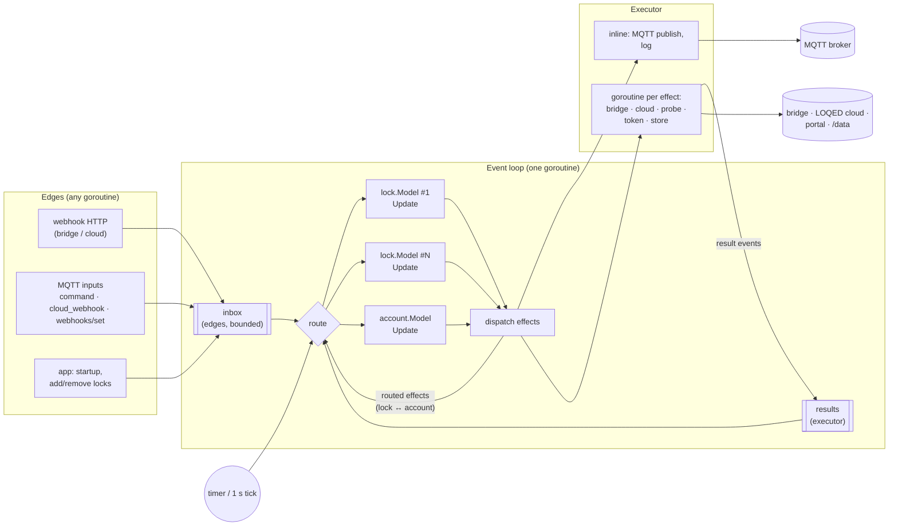
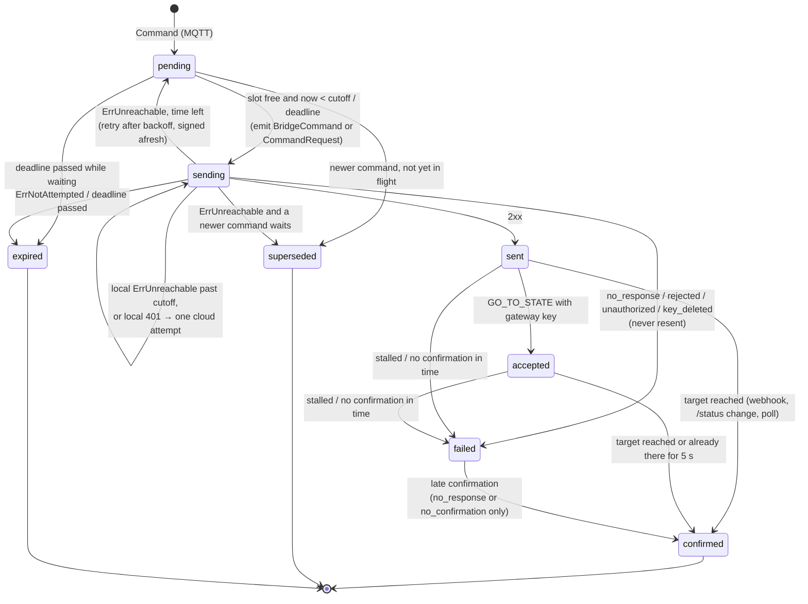
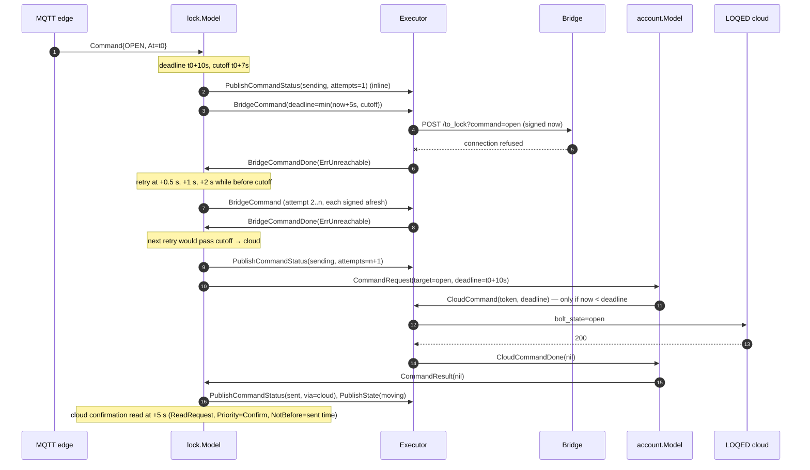
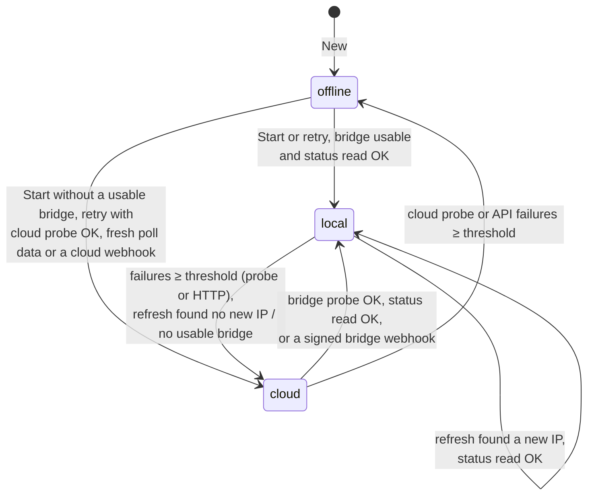
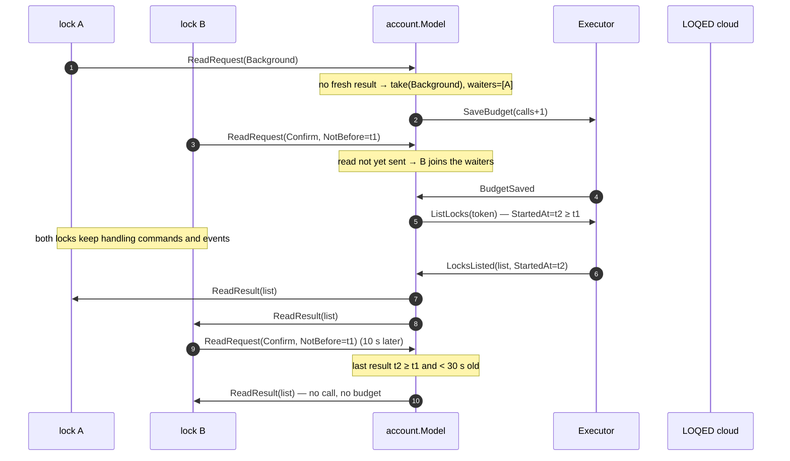

# loqed-mqtt: Elm-style engine (reducers + effects) — Design

Date: 2026-10-10
Status: Draft, for review
Findings: ARCH H1 (blocking I/O on the per-lock goroutine), ARCH H2 (`Supervisor` is a god object), COR M1 (an attempt can start after its deadline); see `.superpowers/sdd/2026-10-10-project-review/`.
Supersedes: `2026-10-10-nonblocking-supervisor-design.md` (incremental fix, not implemented).
Builds on: `2026-10-04-loqed-mqtt-gateway-design.md` (the gateway spec; "gateway 5.8" etc. refer to its sections). That spec stays the source of truth for **what** the gateway does; this one changes **how** it is structured.

## 1. Context

Today every lock runs a `Supervisor` goroutine (`internal/gateway`, ~2,900 lines) that does its own I/O synchronously: bridge HTTP calls, cloud reads through the shared `CloudHub` (semaphore, budget, token minting), credential refreshes, MQTT publishes that wait for PUBACK. Two consequences:

- **Blocking (ARCH H1, COR M1).** A slow broker, another lock's cloud read or a token mint delays a lock's commands and events. An OPEN can be sent after its 10 s deadline because nothing re-checks the deadline after the waits before the call.
- **Structure (ARCH H2).** About 60 fields on one struct, mutated from helpers that call each other re-entrantly (`commandPipeline.busy` exists only to stop re-entry through failover and `/status`). Behaviour is hard to see and hard to test without the full harness.

The chosen fix is a redesign in the style of the Elm Architecture: state changes in pure reducers, I/O described as data ("effects") and run by an executor that reports results back as events.

## 2. Goals and success criteria

1. **Nothing waits on the loop.** The event loop never performs network I/O and never waits for an MQTT acknowledgement. A lock command waits at most for its own lock's bridge call already in flight (≤ `RequestTimeout`, 5 s), as today.
2. **No attempt after its deadline (COR M1).** The reducer decides an attempt with the current time; the executor refuses to start a request whose deadline has passed and reports it as not sent.
3. **Isolation.** One lock's slow cloud read, refresh or token mint never delays another lock's commands, events or reads.
4. **Readable state.** Each lock's state is one plain struct of named groups; every transition is a case in `Update`; tests drive `Update` with events and assert effects, no goroutines or sleeps.
5. **Same behaviour.** All CLAUDE.md safety invariants hold; MQTT topics and payloads, HTTP endpoints, config, cache format and logs keep their meaning. Every existing behaviour test is ported and passes against the new engine before the swap.

## 3. Non-goals

- No change to the library module (`loqed`, `bridge`, `cloud`, `cloud/portal`) or its API.
- No change to `internal/config`, `internal/store` file format, `internal/model`, `internal/mqtt/hass`, the webhook HTTP surface or the add-on.
- No new external dependency, no framework. The plumbing is our own (~200 lines), with bubbletea-style names (`Model`, `Update`, `Msg`/`Event`) but effects as data, not functions.
- No new features. Where the new structure forces a small behaviour difference it is listed in §13 and needs the reviewer's explicit acceptance.

## 4. Architecture overview



- **Edges** turn outside input into events and put them on the inbox without blocking (full inbox → `ErrBusy`, as today's per-lock queue).
- The **loop** stamps each event with the current time, routes it to one reducer, and dispatches the returned effects in order.
- **Reducers** (`lock.Model`, `account.Model`) are deterministic: `(model, now, event) → model', effects`. No I/O, no clock, no goroutines, no logger.
- **Routed effects** are messages between reducers (a lock asks the account for a cloud read; the account answers). The loop delivers them as events in the same dispatch round, so they never touch the executor.
- The **executor** runs I/O effects. Fast, ordered ones (MQTT publishes, log lines) run inline; network and disk work runs in a goroutine per effect and comes back as a result event.

## 5. Core types and packages

```
loqed-mqtt/internal/engine/            loop, Event/Effect plumbing, Directory (edge snapshot), Program API
loqed-mqtt/internal/engine/lock/       per-lock reducer (one file per state group, see §6)
loqed-mqtt/internal/engine/account/    account reducer: budget, shared reads, token, cloud commands, refresh
loqed-mqtt/internal/engine/effect/     effect and result-event types shared by reducers and executor
loqed-mqtt/internal/engine/exec/       executor: bridge/cloud/probe/token/store/MQTT adapters
```

Dependency direction: `lock`, `account` → `effect`, `model`, `store` (types only), library types. `exec` → `effect`, library clients, `auth`, `store`, and the `Publisher` interface (satisfied by `*mqtt.Client`). `engine` → all of them. `lock` and `account` never import each other, `exec`, `mqtt` or `auth`.

### 5.1 Contracts (signatures, not code)

| Name | Shape | Notes |
|---|---|---|
| `effect.Event` | marker interface | Every input to a reducer. Result events carry the `Ref` of the effect that caused them. |
| `effect.Effect` | marker interface | Either `Routed` (has `Target() Address`) or I/O (executed). |
| `effect.Ref` | `struct{ Lock string; Seq uint64 }` | Unique per effect; the reducer that emitted an effect keeps its `Ref` to match the result. |
| `effect.Address` | `Account` or `Lock(id)` or `Program` | Destination of a routed effect. |
| `lock.Model` | struct, state groups in §6 | `New(rec store.LockRecord, env Env) *Model` |
| `(*lock.Model).Update` | `(now time.Time, ev effect.Event) []effect.Effect` | Mutates only its own model. |
| `(*lock.Model).Due` | `() time.Time` | Earliest scheduled time (zero: none). |
| `lock.Env` | static config + pure functions | `Timing`, `Setting`, `KeyNames`, `CloudWebhooks bool`, `WebhookURL(rec) (string, error)`, `ValidateBridge(rec) error` (wraps `bridge.New`, no I/O). |
| `account.Model` | struct, §7 | `New(budget store.BudgetState, env Env) *Model` |
| `(*account.Model).Update` / `Due` | as for `lock.Model` | |
| `engine.Program` | loop + models + executor | `New(Options)`, `Run(ctx)`, `Submit(Event) error`, `AddLocks([]store.LockRecord)`, `Await(ctx, ref) (Event, error)` (startup only), `Directory() *Directory` |
| `engine.Directory` | concurrency-safe snapshot for edges | `BridgeKey(id)`, `BindCloudID(id, cloudID) error`, `Health() map[string]Health`, `Known(id) bool` |
| `exec.Executor` | `Run(ctx, effect.Effect)` | Inline or goroutine; results go to the loop's results channel. |

**Why mutate in place.** Go has no persistent data structures; copying a model with slices and maps on every event is error-prone. `Update` mutates the model it is called on and nothing else, so it is still a deterministic function of (model, now, event) and tests can snapshot and compare models.

**Time.** Reducers never read a clock. `now` comes from the loop per dispatch; the loop's clock is injected (`Options.Now`), so tests control it. Schedules are absolute times in the model (`nextProbe`, `confirmAt`, …).

### 5.2 The loop

```
loop:
    arm timer at min(Due() over all models), but at most 1 s ahead   // 1 s heartbeat = today's ticker
    select:
        ctx done                → return
        event from inbox        → dispatch(event)
        event from results      → dispatch(event)           // results for removed locks are dropped
        timer                   → dispatch(Tick) to every model whose Due() ≤ now, and to all on the heartbeat

dispatch(event):
    queue := [event]
    while queue not empty:
        ev := pop front; now := clock()
        effects := target(ev).Update(now, ev)
        for each effect in order:
            if routed → push back to queue as event
            else      → executor.Run(effect)               // inline publishes keep effect order
    refresh Directory health snapshot if any lock's Health changed
```

- The heartbeat keeps today's 1 s cadence, so a schedule a reducer forgot to report in `Due()` is late by at most 1 s. `Due()` exists for sub-second schedules (local command retries after 0.5 s).
- Routed effects are processed in the same round, FIFO, so "lock asks account, account answers from its shared result" completes without a timer turn.
- Two channels: the inbox (buffered, 256; edges never block, a full inbox returns `ErrBusy`) and results (only executor goroutines send to it and may block until the loop takes the result; the loop never sends to either channel, so it cannot block on them).

### 5.3 Effect catalogue

**Inline I/O** (on the loop, in order):

| Effect | Performed by | Bound |
|---|---|---|
| `PublishState{Ref, Lock, State}`, `PublishAvailability`, `PublishEvent`, `PublishCommandStatus`, `PublishWebhooks`, `PublishWebhooksResult` | `Publisher` (`*mqtt.Client`) | Handoff inline, never waits for PUBACK; bounded by `WriteTimeout` 2 s. The outcome comes back later as `PublishDone` (§8.3). |
| `Log{Level, Msg, Attrs}` | `slog` | — |

**Asynchronous I/O** (goroutine; result event back):

| Effect (emitted by) | Result event | Bound |
|---|---|---|
| `BridgeStatus{Ref, Record}` (lock) | `BridgeStatusDone{Ref, Status, Err}` | `RequestTimeout` |
| `BridgeCommand{Ref, Record, Action, Deadline}` (lock) | `BridgeCommandDone{Ref, Err}`; `Err = ErrNotAttempted` if `Deadline` had passed when the goroutine started | absolute `Deadline` |
| `BridgeListWebhooks{Ref, Record}` | `BridgeWebhooksDone{Ref, Hooks, Err}` | `RequestTimeout` |
| `BridgeCreateWebhook{Ref, Record, URL, Triggers}` / `BridgeDeleteWebhook{Ref, Record, ID}` | `BridgeWriteDone{Ref, Err}` | `RequestTimeout` |
| `ProbeBridge{Ref, Address}` / `ProbeCloud{Ref}` | `ProbeDone{Ref, Err}` | `RequestTimeout` |
| `ResolveToken{Ref, Op, Rejected}` (account) — `Op` ∈ get, invalidate, keyDeleted, checkExpiry | `TokenDone{Ref, Token, Expiry, Reminted, Err}` | portal timeouts |
| `ListLocks{Ref, Token}` (account) | `LocksListed{Ref, Locks, StartedAt, Err}` | `cloudTimeout` 15 s |
| `CloudCommand{Ref, Token, Lock, Target, Deadline}` (account) | `CloudCommandDone{Ref, Err}`; `ErrNotAttempted` as above | absolute `Deadline`, ≤ 15 s |
| `SaveBudget{Ref, State}` (account) | `BudgetSaved{Ref, Err}` | disk |
| `MergeLocks{Ref, Locks, TokenHash}` (account) | `LocksMerged{Ref, Records, Removed, Err}` | disk |
| `SaveCloudID{Lock, ID}` (Directory) | none (failure logged by the executor) | disk |
| (outcome of any `Publish*` above) | `PublishDone{Ref, Kind, Err}`; `Kind` names the topic kind (state, event, availability, command_status, webhooks, webhooks_result), never the payload | `PublishTimeout` 30 s → `ErrPublishTimeout` |

**Routed** (between reducers, no I/O):

| Effect | From → to | Meaning |
|---|---|---|
| `ReadRequest{Lock, Priority, NotBefore}` | lock → account | One cloud lock list, budgeted (§7.2). |
| `ReadResult{Lock, List, Err}` | account → lock | Shared or fresh list, or `ErrDeferred` / `ErrBudgetExhausted` / `ErrCloudBlocked` / API error. |
| `CommandRequest{Lock, Ref, Target, Deadline}` | lock → account | Cloud command (unbudgeted). |
| `CommandResult{Lock, Ref, Err}` | account → lock | |
| `RefreshRequest{Lock, Reason}` | lock → account | Credential refresh with per-lock backoff. |
| `RefreshResult{Lock, Reason, Record, Err}` | account → lock | `ErrRefreshThrottled` when backing off. |
| `RecordChanged{Lock, Record}` | account → lock | Credentials changed by any refresh. |
| `TokenChanged{Expiry, Known}` | account → every lock | For `token_expires_at` in the state document. |
| `LocksRemoved{IDs}` | account → program | Stop those locks, clear their retained topics. |

## 6. Lock reducer (`engine/lock`)

The `Supervisor` fields become named groups. Each group lives in its own file with the functions that change it; `Update` is a switch on the event type that calls into the groups.

| Group (file) | Contents (today's fields) |
|---|---|
| `identity` (`model.go`) | id, record with lock settings applied, setting, token expiry |
| `conn` (`mode.go`) | mode, failure counters (probe, HTTP, cloud probe, cloud API), schedules (`nextProbe`, `nextCloudProbe`, `nextReconcile`, `nextCloudPoll`, `nextOfflineRetry`, `lastUnknownCheck`), `bridgeUsable` |
| `doc` (`state.go`) | published `model.State`, `lastFreshAt`, `lastEventAt`, `lastPollAt`, `lastCloudEventAt`, `lastBoltEventAt`, health |
| `confirm` (`confirm.go`) | confirmation target/timers, cloud confirmation, retried/rechecked flags, `movement` |
| `delivery` (`delivery.go`) | bridge webhook delivery: `webhookConfirmed`, `lastBridgeEventAt`, `nextUnconfirmedRead`, bridge check |
| `registration` (`register.go`) | `webhookOK`, `nextWebhookRetry`, the registration job |
| `feed` (`eventfeed.go`) | published events for dedup/pairing (moved unchanged) |
| `cmds` (`pipeline.go`) | command pipeline: active, pending, watch |
| `hooks` (`setwebhooks.go`, `webhooklist.go`) | webhook list, revision, SetWebhooks job and queue (`planWebhooks`, `webhookRevision` moved unchanged) |
| `io` (`slots.go`) | in-flight effects: the bridge slot and its queue, the cloud read slot, the refresh slot, probe refs |
| `warn` (`warn.go`) | rate-limited warnings (the 10 min repeat window) |

### 6.1 Lock events

| Event | Source | Handling (summary; details stay as in gateway 5.5–5.9) |
|---|---|---|
| `Start` | program, on add | Enter local if the bridge is usable (queue a status read), else cloud. |
| `Tick` | loop | Run due schedules of the current mode (§6.4). |
| `BridgeEvent{Event}` | webhook HTTP | As `onBridgeEvent`: dedup, apply, confirm, `cmds.onReached/onGoTo`; outside local mode also queue an enter-local status read. |
| `CloudEvent{Event}` | HTTP or MQTT relay | As `onCloudEvent`. |
| `Command{Command, ID, At}` | MQTT | `cmds.Submit` (§6.3). |
| `WebhooksRequest{Body}` | MQTT | SetWebhooks (gateway 5.9). |
| `RecordChanged{Record}` | account | Replace the record, bump `recordGen`, recompute `bridgeUsable`. |
| `TokenChanged` | account | Store expiry; next state publish carries it. |
| result events (§5.3) and `ReadResult`, `CommandResult`, `RefreshResult` | executor / account | Matched by `Ref` to the waiting operation (§6.2). |
| `PublishDone{Kind, Err}` | executor | No state change. On an error: a rate-limited warning `publishing <kind> failed` (today's per-call warnings). Nothing waits for it: no transition depends on a PUBACK. |

### 6.2 I/O slots and operations

Today's call chains (`tryEnterLocal` → status → `registerWebhook` → list → delete → create → re-read) become **operations**: small records in the model that remember why an effect was emitted and what to do with its result.

- **Bridge slot.** At most one bridge HTTP effect per lock is in flight (the bridge is used one call at a time today; SetWebhooks makes "one bridge call per step"). Further bridge operations wait in a short queue: a **command attempt goes first**, everything else in FIFO order. A queued operation has a precondition (for most: `mode == local`), checked when it is issued; an operation whose precondition no longer holds is dropped (its continuation runs its "not done" branch, e.g. a dropped confirmation read schedules the cloud confirmation if it was asked to).
- **Status read coalescing.** All reasons for `/status` (enter local, reconcile, webhook-unconfirmed read, unknown-bolt recheck, command/movement confirmation) share one queued or in-flight read. The read keeps a set of purposes; each purpose's continuation runs on the result in today's order.
- **Cloud read slot.** At most one `ReadRequest` outstanding per lock; further requests merge: a confirmation request replaces a queued background poll; of two confirmation requests the later `NotBefore` wins. The merged request is sent when the result arrives.
- **Refresh slot.** At most one `RefreshRequest` per lock; a second reason while one is outstanding is queued once.
- **Probes.** Not HTTP, so outside the bridge slot; at most one bridge probe and one cloud probe in flight.
- **Results always reach their operation.** A result is never dropped because the mode changed meanwhile; the operation's continuation evaluates today's conditions against the model as it is when the result arrives. Bridge failures count toward failover only if they came from the current `recordGen` (a result from the previous IP says nothing about the new one).

### 6.3 Command pipeline

`engine/lock/pipeline.go` keeps today's rules (gateway 5.8): latest command wins, one pending slot, deadlines (LOCK/UNLOCK 30 s, OPEN 10 s from MQTT arrival), local cutoff (10 s, OPEN 3 s, before the deadline), local backoff 0.5 s / 1 s / 2 s, one cloud attempt, retry only after `ErrUnreachable` (or no usable bridge) or `ErrUnauthorized`, never after `ErrNoResponse` or any answer. What changes is that an attempt is now two steps: **emit** and **result**.

- **In flight counts as written for superseding.** While an attempt's effect is in flight, the request may reach the lock, so a newer command waits in `pending` exactly as behind a written command. If the result is `ErrUnreachable` (provably not sent) and a newer command is pending, the older command is superseded instead of retried and the pending one becomes active.
- **COR M1.** The reducer decides an attempt only with `now < cutoff` (local) or `now < deadline` (cloud), at the moment it emits the effect, after the `sending` status publish that precedes it in the same effect list. The effect carries an absolute deadline: local `min(now + RequestTimeout, cutoff)`, cloud `deadline`. The executor checks the deadline again when its goroutine starts and returns `ErrNotAttempted` without dialing if it has passed; the account checks it again before it emits `CloudCommand` (a token may have had to be resolved first). `ErrNotAttempted` is provably not sent: the reducer treats it like a deadline found passed before the attempt (`expired` for the cloud attempt, fall through to the cloud for a local one past its cutoff).
- **A result after the deadline** of a request that started in time is applied as today: a 2xx is `sent`, `ErrNoResponse` is `no_response` with confirmation, a cloud result after the local mode was left still confirms by poll.





### 6.4 Modes



The mode transitions and their side conditions stay as in gateway 5.5. The `Tick` handler per mode issues the same checks in the same order as today's `tickLocal`/`tickCloud`/`tickOffline`, but each check that needs I/O queues an operation instead of calling; the next check runs on the same tick unless the previous one changed the mode synchronously (today's early `return`s).

### 6.5 Other groups

- **Confirmation, status hint, movement** (`confirm.go`, `statushint.go`): moved unchanged in logic; they read and write only the model.
- **Event feed** (`eventfeed.go`): moved unchanged.
- **Webhook registration** (`register.go`): an operation with steps list → delete stale (one effect each) → create → re-read; a 401 on any step issues a `RefreshRequest` and retries the job once with the new record (today's `registerWebhook`). Not started while a SetWebhooks job runs.
- **SetWebhooks** (`setwebhooks.go`): the job already is a step machine; its bridge calls go through the bridge slot and never start while a command is busy (unchanged rule). `planWebhooks` and `webhookRevision` move unchanged with their tests.
- **Warnings**: `Log` effects; the reducer keeps today's rate-limit state, so tests can assert both the line and the `repeated` count.

## 7. Account reducer (`engine/account`)

Owns everything shared by all locks: the budget, the token in use, shared read results, the cloud command path and credential refresh. It replaces `Budget`, `CloudHub`, `Refresher`, `watchTokenExpiry` and `refreshByAge`.

| Group | Contents |
|---|---|
| `budget` | `calls []time.Time`, `lastBackground`, `blockedUntil`, limit, window (today's `Budget` without its mutex) |
| `token` | token in use (or none), state `none · resolving · ready`, waiters, expiry |
| `reads` | read in flight (ref, priority, started), waiters (lock, priority, notBefore), last result (`LockList`) |
| `commands` | cloud commands waiting for a token, in flight (ref → lock, retried-after-401 flag) |
| `refresh` | per lock+reason backoff (5 min doubling to 6 h), the refresh-all job, waiters |
| `schedules` | next token expiry check (hourly), next cache-age check (hourly when `cache_max_age` > 0) |

### 7.1 Budget persisted before the read

The invariant "crash loops must not exceed the budget" needs the call recorded on disk before the request leaves:

```
on read due:
    if blocked → answer waiters ErrCloudBlocked
    take(priority) on the in-memory budget → ErrBudgetExhausted / ErrDeferred to waiters
    emit SaveBudget(state)                         // read not yet sent
on BudgetSaved:
    emit ListLocks(token)                          // save failure: logged once, read still sent (as today)
on LocksListed 401:
    refund the last call; emit SaveBudget; emit ResolveToken(invalidate, rejected)
    on new token: take(priority) again → SaveBudget → ListLocks (once)
on LocksListed 429:
    block 12 h; emit SaveBudget; log error
```

### 7.2 Shared reads

- A `ReadRequest` whose `NotBefore` is not after the last result's `FetchedAt`, while that result is younger than 30 s, is answered at once from it (today's coalescing).
- Otherwise the request waits. One read is in flight at a time, account-wide. When it finishes, it answers every waiter whose `NotBefore` ≤ the read's `StartedAt`; waiters with a later `NotBefore` (they arrived during the read and need newer data) stay for the next read.
- A read is taken from the budget once, with the **most urgent priority among its waiters**; when a background waiter is served by it, `lastBackground` moves to its start (spacing holds). This can only save calls compared to today (§13).
- An answer is `ReadResult{List, Err}` per waiting lock; each lock applies it with today's `pollCloud` rules.



### 7.3 Token

- `ResolveToken(get)` when a read or command needs a token and none is ready; all needs wait on the one resolution. The executor calls the existing `auth.Resolver` (which keeps its persisted mint throttle and mutex; it is not on the loop).
- A 401 on a read or command emits `ResolveToken(invalidate, rejected)` once and retries that one request with the new token.
- A cloud command answered `cloud.ErrKeyDeleted` is never resent; `ResolveToken(keyDeleted)` replaces the token for the next request (today's `CloudHub.Command`).
- Hourly `ResolveToken(checkExpiry)` (today's `watchTokenExpiry`); a remint drops the token in use and starts a refresh-all, whose records reach the locks as `RecordChanged`.
- Every token change emits `TokenChanged{Expiry}` to all locks.

### 7.4 Cloud commands

Unbudgeted and never queued behind reads: a `CommandRequest` waits only for a token if none is ready. Before emitting `CloudCommand` the account checks `now < Deadline`; otherwise it answers `ErrNotAttempted`.

### 7.5 Refresh

- `RefreshRequest{Lock, Reason}`: if lock+reason is backing off → `RefreshResult(ErrRefreshThrottled)`. Otherwise mark the attempt (next = now + interval) and join the refresh-all job.
- Refresh-all is a read with `PriorityRefresh` through §7.1, then `MergeLocks` (the executor runs today's `RefreshAll` merge under `store.Update`: keep cached local credentials, empty list never applied over a non-empty cache, removed ids).
- On `LocksMerged`: every waiting lock gets `RefreshResult(record)` and the backoff updates as today (same local credentials → double, change → reset); every lock whose record changed gets `RecordChanged`; removed ids go out as `LocksRemoved`.
- `cache_max_age` (hourly check) and token remint start a refresh-all without a waiting lock.

## 8. Executor (`engine/exec`)

### 8.1 Goroutines and contexts

- One goroutine per asynchronous effect, with a context derived from the program context and the effect's deadline or timeout. No pools: in-flight effects are bounded by the slots in §6.2 and §7 (per lock: one bridge call, two probes, one read request, one refresh; account: one read, one token operation, one store write of each kind, the cloud commands in flight). Publish-outcome goroutines are not slot-bounded but each ends at PUBACK, on a paho error or after 30 s.
- `ErrNotAttempted`: before dialing a command (bridge or cloud), the goroutine checks its absolute deadline.
- Results are sent to the loop's results channel; on shutdown they are dropped.

### 8.2 Bridge clients

The executor builds a `*bridge.Client` per lock and `recordGen` on first use (pure construction, as `NewBridge` today) and keeps one per lock. As defence in depth it serializes bridge calls per lock with a mutex; the reducer's bridge slot should make it uncontended, and a test asserts that it never is.

### 8.3 MQTT publishing

- `SetWriteTimeout(2 * time.Second)` in the client options: a stuck socket costs the loop at most 2 s once; paho then drops the connection and later publishes fail at once until it reconnects.
- `publish` hands the message to paho and returns its token; it does not wait for PUBACK.
- **Publish outcomes as events.** For each `Publish*` effect the executor starts a goroutine that waits for the token (`Done()`, or `PublishTimeout` 30 s, or program shutdown) and sends `PublishDone{Ref, Kind, Err}` to the emitting lock: `nil` on PUBACK, the paho error (not connected, handoff timeout, connection lost), or `ErrPublishTimeout`. The goroutine is the only waiter; the loop never waits. Outcomes may arrive in any order, and reducers must not depend on that order. The reducer turns errors into rate-limited warnings today; the event is also the hook for anything that later needs delivery feedback (metrics, a health flag). Publishes the MQTT client makes on its own (discovery, the reconnect republish, removed-lock cleanup) produce no events.
- `retainMu` covers one topic's "update cache, hand to paho"; the reconnect republish takes it per topic and sends that topic's current value, so a concurrent newer value is never overtaken by a stale one.
- Publishes run inline on the loop in effect order, so a lock's messages leave in the order its reducer produced them (paho has one writer). There is no queue of our own: paho's writer is the queue.
- `Close` publishes the retained `offline` status and waits for it at most 2 s, then disconnects with a short quiesce (as today).

### 8.4 Shutdown

Cancelling the program context: the loop stops; the executor cancels in-flight effects and waits for its goroutines for at most 5 s (every effect is bounded by its own timeout anyway); results are discarded. The app then shuts the HTTP server down and closes MQTT, as today.

## 9. Edges

| Edge | Today | New |
|---|---|---|
| Bridge webhook HTTP | `Manager.BridgeKey`, `DeliverBridgeEvent` → per-lock queue | `Directory.BridgeKey` (snapshot updated on `RecordChanged`); `Program.Submit(BridgeEvent)`; full inbox → 503. PR #31's replay memory stays in `internal/webhook`. |
| Cloud webhook HTTP / MQTT relay | `Manager.DeliverCloudWebhook` → `BindCloudID` under the supervisor's mutex | `Directory.BindCloudID` (same rules, synchronous, so HTTP still answers 409 on a mismatch); persisting a newly learned id is an executor `SaveCloudID` effect. |
| MQTT command / webhooks/set | `forwardCommands` / `forwardWebhooksRequests` goroutines → `Manager` | Same goroutines → `Program.Submit`. Undelivered SetWebhooks requests are answered as today. |
| `/healthz` | `Manager.Health` reads each supervisor under a mutex | `Directory.Health` (snapshot written by the loop after each dispatch). |
| Startup refresh | `initialRefresh` with `Refresher` | The program starts with no locks; app submits `RefreshAll{Startup}` and `Await`s it (same decision rules as `initialRefresh`); then `AddLocks(selected)`. |
| Removed locks | `Refresher.OnRemoved` → goroutine → `Manager.Remove` | `LocksRemoved` → the program deletes those models (their in-flight results are dropped) and calls the app's `OnRemoved` (retained topic cleanup, `published_ids`). |
| Retained inputs | ignored in `internal/mqtt` | unchanged |

## 10. Safety invariants → where they are enforced

| Invariant (CLAUDE.md) | Enforced by | Proven by |
|---|---|---|
| Retry only after `ErrUnreachable`/no bridge/`ErrUnauthorized`; never after `ErrNoResponse` or an answer | `pipeline.go` result handling; in-flight attempts count as written for superseding | ported pipeline tests; new: "newer command during an in-flight attempt waits", property test "no `BridgeCommand`/`CommandRequest` after a result other than unreachable/unauthorized/not-attempted" |
| Every attempt signed afresh | executor signs per `BridgeCommand` (library signs per call) | ported test (two attempts, two timestamps) |
| `DisableKeepAlives` on bridge/cloud clients | library, unchanged | library tests |
| Only webhooks confirm; `/status` is a hint | `confirm.go`, `statushint.go` moved unchanged | ported statushint and pipeline tests |
| Retained `command`/`cloud_webhook`/`webhooks/set` ignored | `internal/mqtt`, unchanged | unchanged tests |
| SetWebhooks: valid and revision-matched before any write; never touches the own webhook; one call per step; never during a command | `setwebhooks.go` + bridge slot + "no step while command busy" | ported setwebhooks tests; new: "a command arriving during a SetWebhooks step waits only for that step, and the next step waits for the command" |
| Budget persisted; crash loops cannot exceed it | `SaveBudget` before `ListLocks` (§7.1) | new: "`ListLocks` is never emitted before `BudgetSaved` for its call"; ported budget tests |
| 401 reads refunded (V12) | §7.1 | ported cloudhub 401 tests |
| Bridge wire details, timestamp tolerance | library and `internal/webhook`, unchanged | unchanged tests |
| No definite state older than reality without `state_stale` | `state.go`, `confirm.go`, `freshness` moved unchanged; results applied with the fetched-at guard | ported tests; new: "a poll result arriving after a newer webhook does not overwrite it" |
| No attempt after its deadline (COR M1, gateway 5.8) | reducer check at emit + executor `ErrNotAttempted` + account check before `CloudCommand` | new tests per layer (§11) |

## 11. Behaviour (BDD skeleton)

```
engine.Program
    Run
        On an edge event
            - stamps it with the clock's now and routes it to its lock's Update
        On a routed effect
            - delivers it to the target reducer in the same dispatch round, after the effects before it
        On an I/O effect
            - runs it inline (publish, log) or in a goroutine (everything else), in effect order
        On a result for a removed lock
            - drops it
        On the timer
            - sends Tick to every model whose Due is reached, and to all models every second
        On context cancel
            - returns; executor goroutines are cancelled and their results discarded
    Submit
        On a full inbox
            - returns ErrBusy without blocking
        On an unknown lock
            - returns ErrUnknownLock
    AddLocks
        - creates a model per record and delivers Start
    LocksRemoved
        - deletes the models and calls OnRemoved with their ids

engine.Directory
    BindCloudID
        On the first cloud webhook for a lock
            - learns the id and emits SaveCloudID
        On a different id later
            - returns CloudIDMismatchError naming both ids
    BridgeKey
        - returns the key of the lock's current record (updated on RecordChanged)
    Health
        - returns the snapshot written after the last dispatch

lock.Model.Update
    Start
        On a usable bridge
            - queues a status read with purpose enter-local
        Without a usable bridge
            - enters cloud mode: publishes stale state, emits ReadRequest(Background)
    Tick
        In local mode
            - queues the due checks in today's order (confirmation read, registration retry, bridge check, unconfirmed read, probe, unknown recheck, reconcile)
            - never queues a second status read while one is queued or in flight
        In cloud mode
            - emits ProbeBridge when due and ProbeCloud when due
            - emits ReadRequest(Background) when the poll is due and no read request is outstanding
            - marks the state stale when no fresh data arrived within the expected interval plus grace
        In offline mode
            - every OfflineRetry: probes the bridge, then the cloud
    BridgeStatusDone
        On success with purpose enter-local
            - switches to local mode, applies the status, starts webhook registration, publishes state
        On success with purpose confirmation
            - applies the status as a hint; confirms the active command if the read shows the change
            - schedules one recheck after StatusRecheck while the movement is unresolved
        On failure
            - marks the state stale and counts an HTTP failure (current recordGen only)
            - with purpose confirmation via cloud: schedules the cloud confirmation
        On 401
            - emits RefreshRequest(unauthorized) unless the keys are pinned
    BridgeEvent
        Outside local mode
            - queues an enter-local status read and applies the event anyway
        On a duplicate
            - publishes nothing
        On STATE_CHANGED with the target of the active command
            - confirms it and lets the pending command go
    CloudEvent
        - as onCloudEvent today; a dropped duplicate may name the published event
    Command
        In offline mode
            - fails it offline at once
        While an attempt of another command is in flight
            - keeps the new command pending; supersedes an older pending one
        On the same command as the latest
            - coalesces (new id, one status publish)
        On a free bridge slot in local mode before the cutoff
            - publishes sending, then emits BridgeCommand with deadline min(now+RequestTimeout, cutoff)
        With the bridge slot busy
            - issues the attempt first when the slot frees, re-checking the cutoff then
    BridgeCommandDone
        On nil
            - marks sent via local, starts movement and confirmation, publishes state
        On ErrUnreachable with time before the cutoff
            - schedules a retry after the backoff (Due reports it)
        On ErrUnreachable with a newer command pending
            - supersedes this command; the pending one becomes active
        On ErrUnreachable past the cutoff, or ErrUnauthorized
            - publishes sending and emits CommandRequest (one cloud attempt)
        On ErrNotAttempted
            - treats the local attempt as past its cutoff
        On ErrNoResponse or an answer
            - fails it (no_response / rejected), never resends, starts confirmation, marks stale if the bolt may have moved
    CommandResult
        On nil
            - marks sent via cloud and schedules the cloud confirmation
        On ErrNoResponse
            - fails no_response, never resends, schedules the cloud confirmation
        On ErrNotAttempted
            - expires the command
        On key_deleted
            - fails it and refreshes credentials once it resolved
    ReadResult
        On a list with this lock
            - applies it with the fetched-at guard; a confirmation result may confirm or fail the active command
        On ErrDeferred
            - changes nothing
        On ErrBudgetExhausted, ErrCloudBlocked or rate limited
            - marks the state stale
        On another error
            - counts a cloud API failure; offline after the threshold in cloud mode
        - sends the merged queued request, if any
    RefreshResult
        On a new record with another IP after unreachable
            - queues an enter-local status read
        On a new record after unauthorized
            - rebuilds and retries what was waiting (registration job, or nothing)
        On ErrRefreshThrottled or failure
            - falls back to cloud mode when local mode cannot continue
    WebhooksRequest
        - checks, plans and steps exactly as gateway 5.9; steps use the bridge slot and wait while a command is busy
    PublishDone
        On nil
            - changes nothing
        On an error
            - logs a rate-limited warning naming the topic kind (never the payload)
    Due
        - returns the earliest of the model's schedules and the next local retry

account.Model.Update
    ReadRequest
        With a result younger than 30 s fetched at or after NotBefore
            - answers at once without budget
        With a read in flight
            - adds a waiter
        Otherwise
            - takes the budget with the most urgent waiter priority and emits SaveBudget
        When blocked after a 429
            - answers ErrCloudBlocked
        When the budget is exhausted for the priority
            - answers ErrBudgetExhausted
        On a background read within the spacing
            - answers ErrDeferred
    BudgetSaved
        - emits ListLocks with the token in use (resolving it first if needed)
    LocksListed
        On success
            - stores the result and answers every waiter whose NotBefore ≤ StartedAt; keeps the others for the next read
        On 401
            - refunds the call, emits SaveBudget and ResolveToken(invalidate); retries the read once with the new token
        On 429
            - blocks reads for 12 h, persists the block and answers waiters ErrRateLimited
    CommandRequest
        Before its deadline with a token
            - emits CloudCommand at once (no wait for reads)
        Without a token
            - emits ResolveToken(get) once and waits
        After its deadline
            - answers ErrNotAttempted
    CloudCommandDone
        On 401
            - replaces the token and retries once
        On key deleted
            - answers the error and emits ResolveToken(keyDeleted); never resends
    RefreshRequest
        While backing off
            - answers ErrRefreshThrottled
        Otherwise
            - joins the refresh-all job
    LocksMerged
        - answers waiting locks, updates their backoff, emits RecordChanged for changed records and LocksRemoved for removed ids
    Tick
        - hourly: ResolveToken(checkExpiry); hourly when cache_max_age > 0: refresh-all if the cache is older

exec.Executor
    Run
        On a publish effect
            - hands it to paho and returns without waiting for PUBACK
            - later sends exactly one PublishDone with the effect's Ref: nil on PUBACK, the paho error, or ErrPublishTimeout after 30 s
        On BridgeCommand or CloudCommand past its deadline
            - returns ErrNotAttempted without a network request
        On a bridge effect
            - uses the client for the record generation; never runs two calls for one lock at once
        On any async effect
            - sends exactly one result event with the effect's Ref

mqtt.Client
    client options
        - set WriteTimeout to 2 s
    publish
        On a broker withholding PUBACK
            - returns without waiting
    reconnect republish
        On a value published concurrently
            - the broker's last message on that topic is the newest value
```

## 12. Testing strategy

- **Reducer tests** (`engine/lock`, `engine/account`): table tests of `(model setup, now, event) → effects + model fields`. No goroutines, no fakes of I/O.
- **Scenario harness** (`engine/lock/harness_test.go`): the ported harness keeps today's verbs (`start`, `advance`, `send`, `command`, `toCloud`). It runs a lock model plus a real account model with a **synchronous fake executor** that resolves each effect against the existing `fakeBridge`/`fakeCloud`/`fakePub` and feeds the result back until quiescent. Existing scenario tests port almost line for line. A **held** mode keeps chosen effects pending so tests can interleave (command during a status read, result after a mode change).
- **Invariant checks**: a harness hook validates every effect list: no `BridgeCommand` after a no-response/answer result for the same command, no two bridge effects in flight per lock, no `ListLocks` without a preceding `BudgetSaved`, no command effect past its deadline.
- **Program tests** (`engine`): routing, ordering of routed effects, `ErrBusy`, removal dropping results, timer/heartbeat, shutdown; run with `-race -count=5`.
- **Executor tests** (`engine/exec`): `PublishDone` for PUBACK, not connected and a withheld PUBACK (timeout), `ErrNotAttempted`, per-lock bridge mutex never contended under the reducer, one result per effect.
- **App integration** (`internal/app`): the existing end-to-end tests (in-process broker, `httptest` bridge and cloud) run unchanged against the swapped wiring.

## 13. Behaviour differences (need explicit acceptance)

1. A command may wait for one in-flight bridge read (≤ 5 s) — same bound as today — but a cloud read or token mint never delays it any more.
2. A shared read is taken with the most urgent waiter's priority, so a background poll waiting next to a confirmation read is served by it: fewer cloud calls, never more.
3. A newer command arriving while an attempt is in flight waits (today it could not arrive during the attempt at all). If the attempt turns out undelivered, the older command ends `superseded` instead of being retried.
4. Bridge HTTP failures from a previous record generation no longer count toward failover.

## 14. Migration (big-bang)

1. **Engine PRs** (new packages only, not wired): `effect` + `engine` loop; `engine/account` (budget, reads, token, commands, refresh) with ported `budget_test.go`, `cloudhub_test.go`, `refresher_test.go`; `engine/lock` in slices (mode + doc + slots; pipeline; confirmation + status hint + event feed; registration + delivery; SetWebhooks + list); `engine/exec`; `mqtt` publishing changes (§8.3, usable by both engines).
2. **Test port map** (old → new; every test name kept or mapped in the PR description):

   | `internal/gateway` test file | Tests | Target |
   |---|---|---|
   | `pipeline_test.go` | 52 | `engine/lock/pipeline_test.go` (harness) |
   | `local_test.go`, `failover_test.go` | 20 + 19 | `engine/lock/mode_test.go` |
   | `delivery_test.go` | 19 | `engine/lock/delivery_test.go` |
   | `eventfeed_test.go`, `cloudevents_test.go` | 19 + 9 | `engine/lock/eventfeed_test.go`, `cloudevents_test.go` |
   | `statushint_test.go` | 12 | `engine/lock/statushint_test.go` |
   | `setwebhooks_test.go`, `setwebhooks_plan_test.go`, `webhooklist_test.go` | 21 + 4 + 11 | `engine/lock/` (plan tests unchanged) |
   | `budget_test.go`, `cloudhub_test.go`, `refresher_test.go` | 8 + 11 + 8 | `engine/account/` |
   | `manager_test.go`, `records_runtime_test.go`, `integration_test.go` | 11 + 3 + 2 | `engine/program_test.go`, `engine/directory_test.go` |

3. **Equivalence checklist** before the swap: every ported test green; the invariant hooks enabled in every scenario test; `internal/app` tests green against a build that wires the engine behind a temporary switch in a test-only branch; a read-only smoke run against the real bridge (status and webhook list only, no commands, no SetWebhooks writes) with zero cloud calls beyond the startup refresh.
4. **Swap PR**: `internal/app` wires `engine.Program`; `internal/webhook` uses `engine.Directory` and `engine` errors (`ErrUnknownLock`, `ErrBusy`, `ErrCloudIDMismatch`); `internal/gateway` is deleted; CLAUDE.md layout and rules (`internal/engine/lock` is the only package that knows local vs cloud; the per-lock loop invariant becomes "the event loop never does network I/O or waits for MQTT acknowledgements"), the gateway spec (§3, 5.5, 5.6, 5.8: concurrency and deadline re-check) and CHANGELOG (`Fixed`: commands are no longer delayed by a slow broker, another lock's cloud read or a token mint, and are never sent after their deadline) updated in the same PR.
5. **Release** as 0.4.0.

**Risks.** Subtle ordering drift between today's synchronous chains and queued operations (mitigated by the ported scenarios and invariant hooks); a schedule missing from `Due()` (bounded to 1 s by the heartbeat); the loop stalling 2 s on a stuck broker socket (once per broken connection); a larger test suite to maintain.

**Rollback.** Revert the swap PR: `internal/gateway` returns from history unchanged; the engine packages stay unused until fixed.

## 15. Documentation

The swap PR updates CLAUDE.md, the gateway spec and CHANGELOG as listed in §14.4. This spec gets "Status: Implemented" then. The superseded nonblocking-supervisor spec gets a "Superseded by" note.
